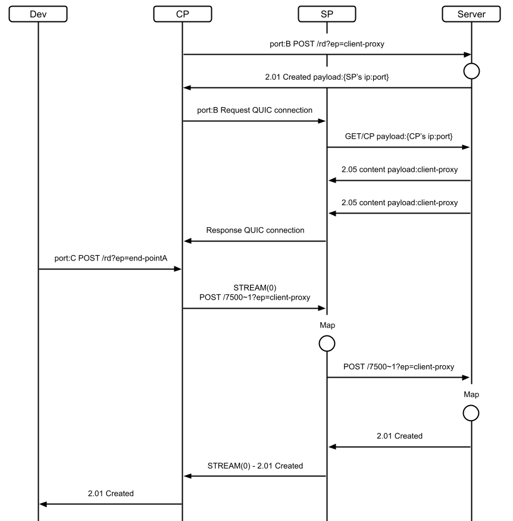
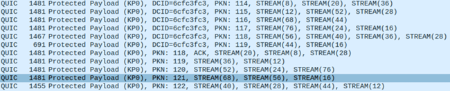
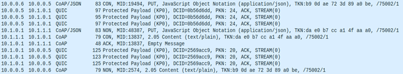
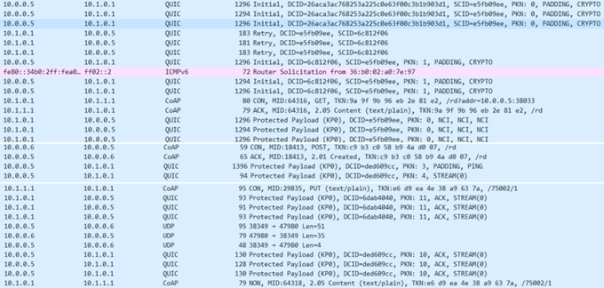

# Mock CompressedCoAP for perforamance analysis

This project is currently being updated. You can view the latest changes on [github.com/Godopu/coap-over-quic-exp](https://github.com/Godopu/coap-over-quic-exp)

# Design

# Messaging
### Stream aggregation 

### Client to Server

### Server to Client
